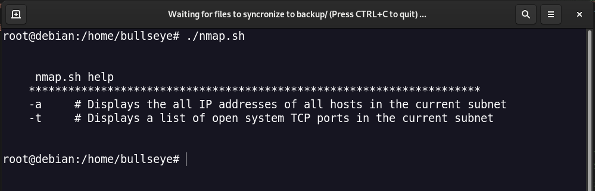
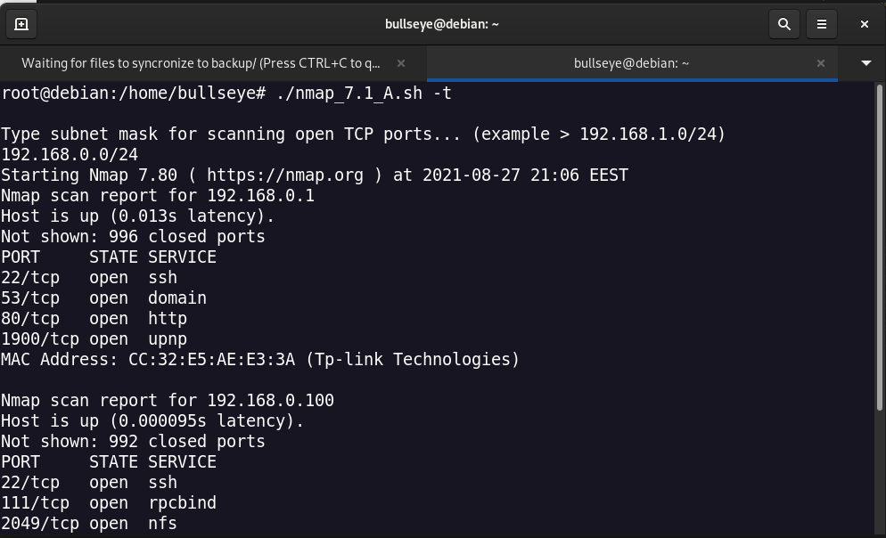
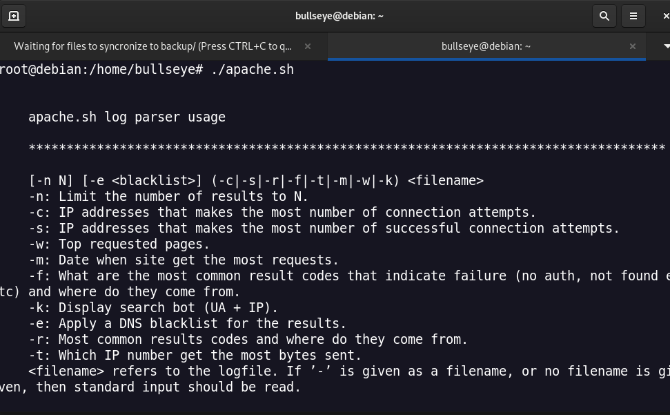
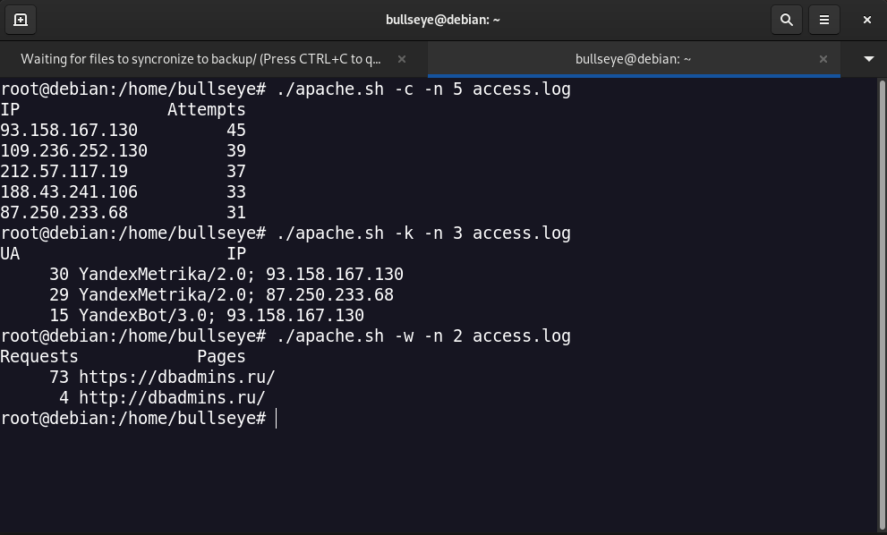

<h1>Task 7.1</h1>

<h3>A. Create a script that uses the following keys</h3>

<h3>B. Using Apache log example create a script to answer the following questions</h3>

[-n N] [-e <blacklist>] (-c|-s|-r|-f|-t|-m|-w|-k) <filename>

**-c: IP addresses that makes the most number of connection attempts.
-s: IP addresses that makes the most number of successful connection attempts.
-w: Top requested pages.
-m: Date when site get the most requests.
-f: What are the most common result codes that indicate failure (no auth, not found etc) and where do they come from.**
**-k: Display search bot (UA + IP).**
*Additional useful keys:*
*-e: Apply a DNS blacklist for the results.
-r: Most common results codes and where do they come from.
-t: Which IP number get the most bytes sent.
-n: Limit the number of results to N.
<filename> refers to the logfile. If ’-’ is given as a filename, or no filename is given, then standard input should be read.*

