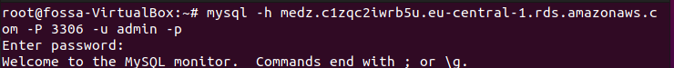

**TASK 3.1**

**Part 1**

1. Download, Install , Configure MySql Server on Ubuntu VM.  

2. Select a subject area and describe the database schema.  

  
  
  

4. Create a database on the server through the console.  

5. Fill in tables.

6. Construct and Execute different SQL queries.

  
  

7. Create users with different privileges & check this privileges.  

  
  
  

8. Selection from the main table DB MySQL.  

   

**Part 2**  

1. Make backup of database.  

2. Delete the table and/or part of the data in the table.  

  

3. Restore database.  

  

4.  Transfer local database to RDS AWS & Connect.  

  
  
  

5. Execute SELECT operator.   

   

6. Create the dump of database.

**Part 3**

1.  Create an Amazon DynamoDB table and enter data.   

   
   

2. Query an Amazon DynamoDB table using Query and Scan.  

  
  

