<h1>Task 6.2</h1>

<h2>VM1 - NAT and internal, VM2, VM3 – internal interfaces </h2>

<h3>Install and configure DHCP server on VM1</h3>

 *Install and configure **SC-DHSPSERVER***    
 
 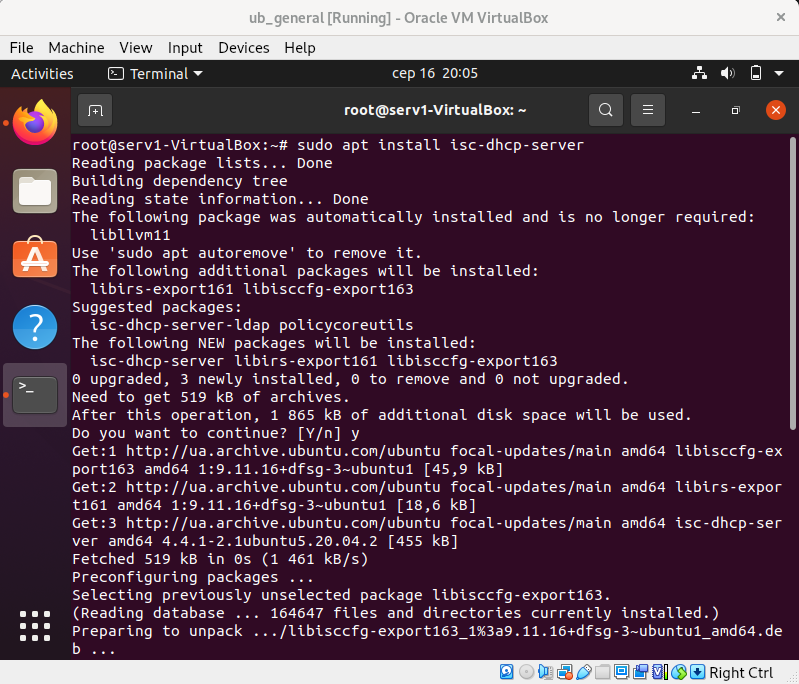  

***/etc/dhcp/dhcpd.conf***  

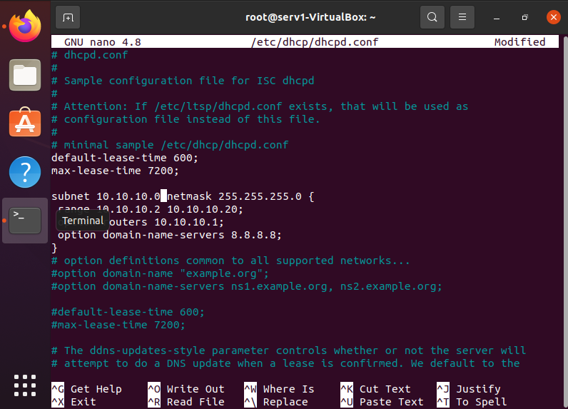  

  ***/etc/default/isc-dhcp-server***  

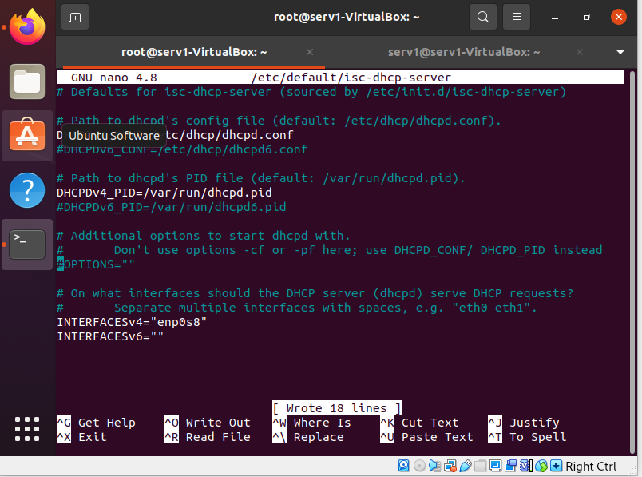  

***restart***

  

  ***Check config***

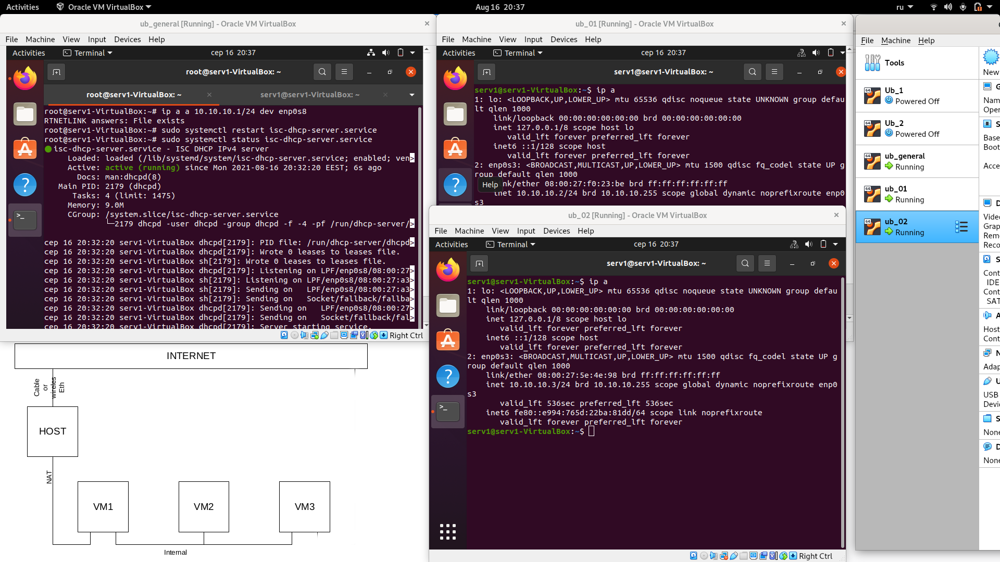  

***Enable forwarding /etc/sysctl.conf***

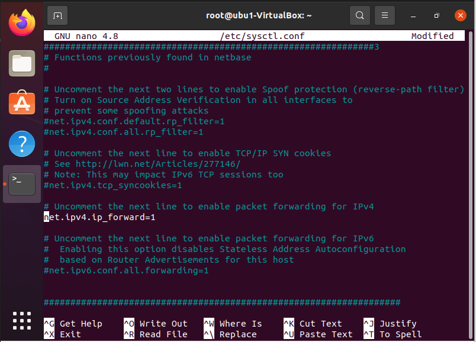  

  ***Add rules in Iptables***

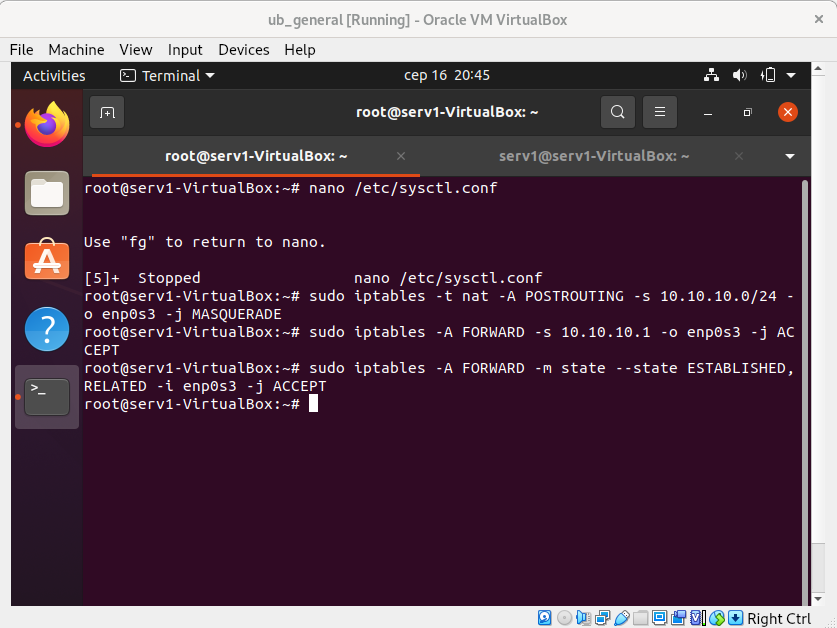  

***Chech the result***
  
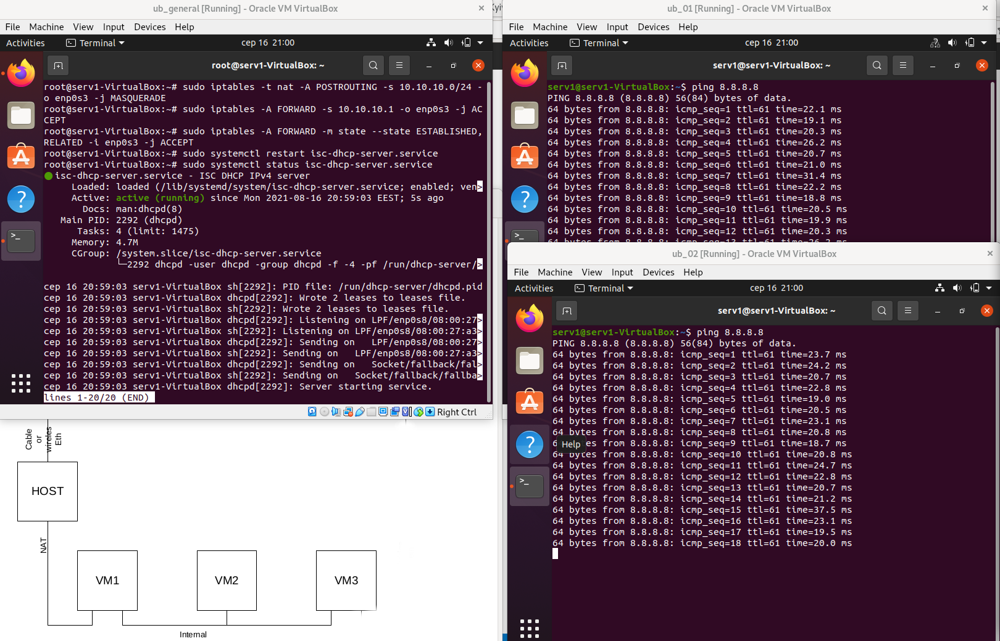  
  

<h3>Install and configure DHCP & DNS server using dnsmasq</h3>

***Install and enable dnsmasq***

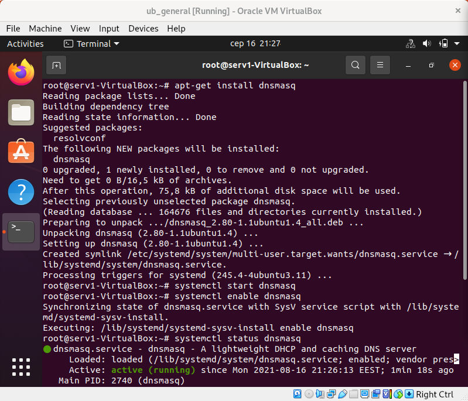   

***/etc/dnsmasq.conf***

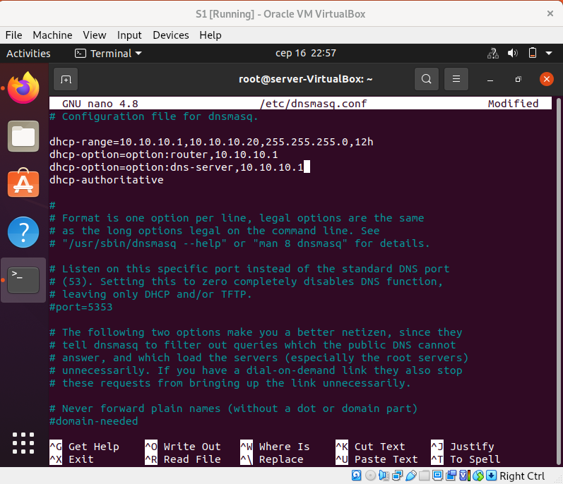  

***Check syntax***

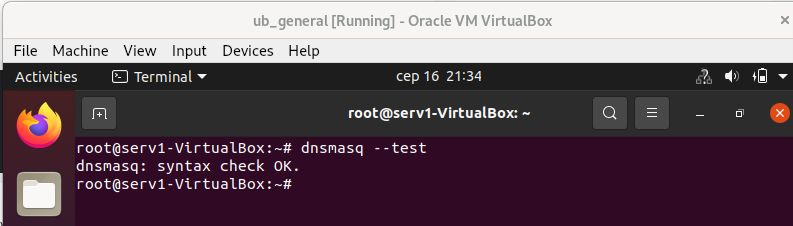  

***Check the configuration of VMs***

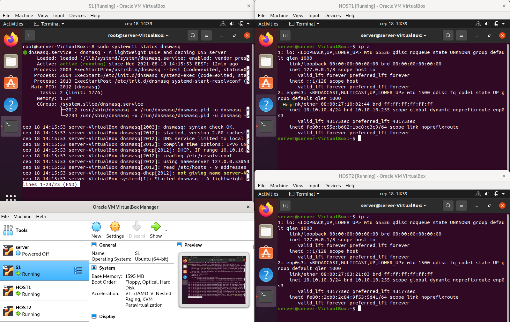  

***Test the connection***

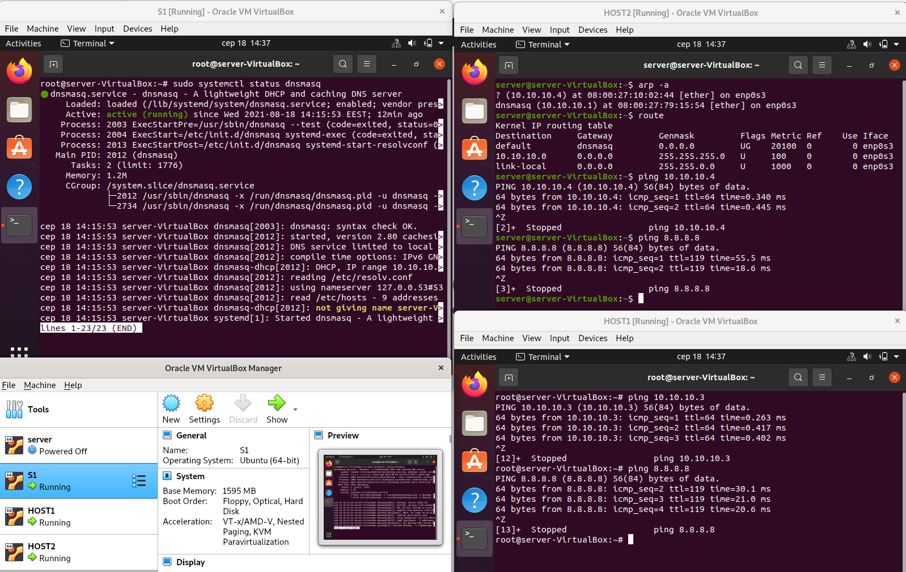  

<h3>Configure dynamic routing using OSPF protocol</h3>
