1. **Git installation**  
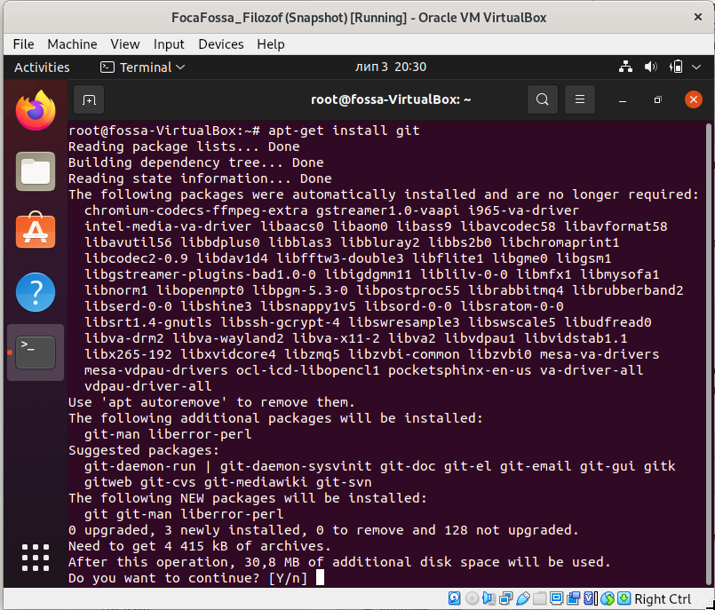
2. **Setup Git**  
 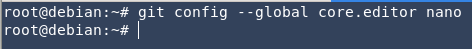
 
3. **Create account, repository, structure**  
 use  github.com WEBUI 
4.  **Clone repo to workstation**  
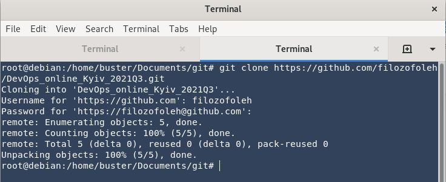
5. **Make init commit, create branches and files**  
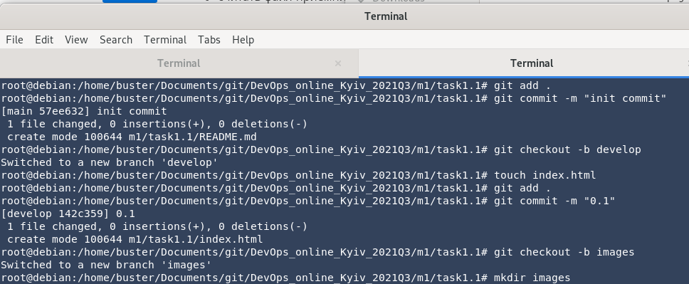
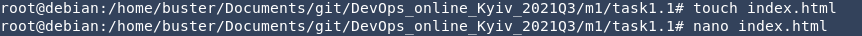
6. **Megre branches**  
- *merging conflict appears*  
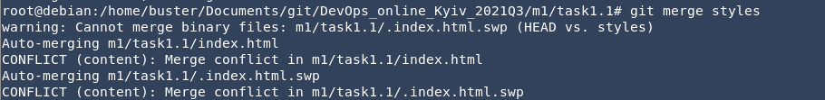
- *fix merging conflict with nano*  
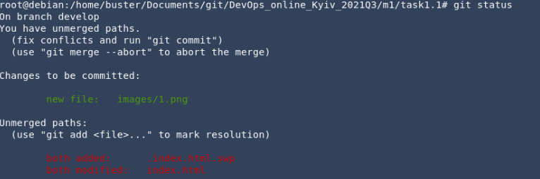
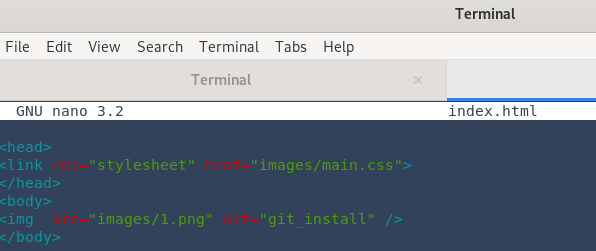  
- *merge develop branch*  
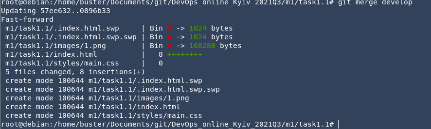  
7. **Work with logs( output & writing)**    
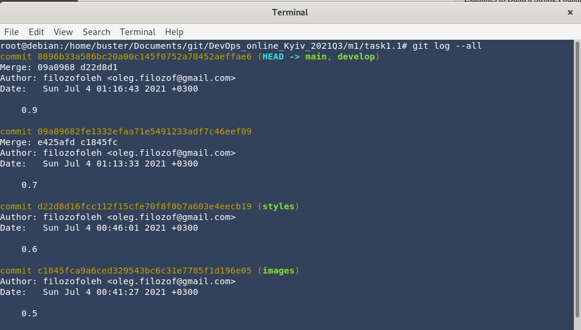
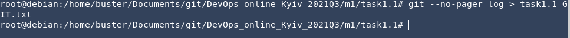
##
**What is DevOps?**  
*This is a set of principles, practices, methodologies that allows to "stick on" Development and Operations,
which speeds up delivery and deployment of the product.*
