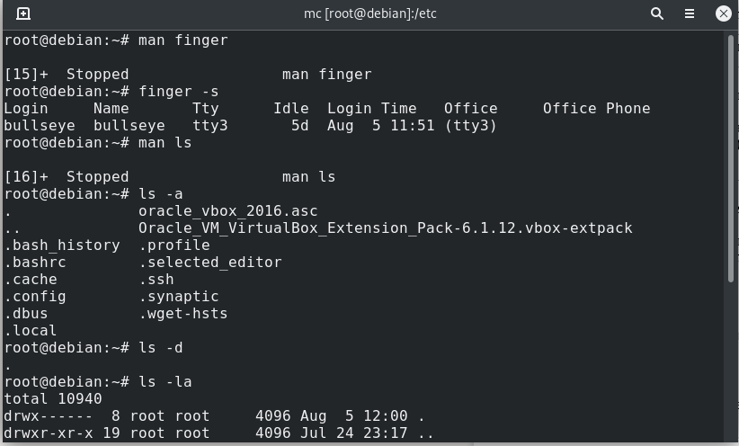
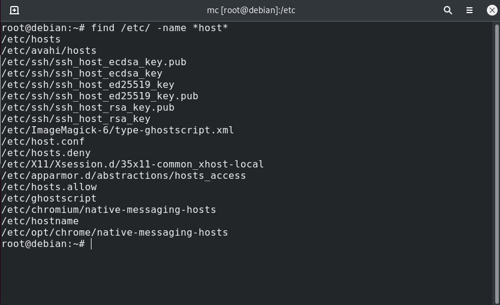

<h1>Task 5.1</h1>  

<h3>  Part 1 </h3> 

***Log in to the system as root and change the password***

    

***etc/passwd file***  

    

***Determine the users registered in the system using $ w , $ who , $ whoami commands***   

    

***Change personal information about yourself***   

*Needed to kill procces before changing login*  

    

***Become familiar with the Linux help system and the man and info commands***  

    

*define and describe two keys for who commands*  
 - who --boot  time of last system boot
 - who --dead print dead processes 

    

***View the contents of files .bash***  

    

    

***Using the finger  & ls commands***  

    

<h3>  Part 2 </h3>  

***Examine the tree command***  

    

    

***Determine the type of file with the file command***  

    

***Navigating the file system using relative and absolute paths***   

    

***Examine the ls command***  

    

***Perform the following sequence of operations(5)***

    

    

***Perform the following sequence of operations(6)***  

    

    

***Using the locate utility, find all files that contain the squid and traceroute sequence***  

    

***Determine which partitions are mounted in the system using mount, df and lsblk***  

    

    

***Count the number of lines containing a given sequence of characters in a given file***  

    

***Using the find command, find all files in the /etc directory containing the host character sequence***  

    

***List all objects in /etc that contain the ss character sequence***  

    

***Organize a screen-by-screen print of the contents of the /etc directory***  

    

***Examine devices and their types with lspci & blkid commands***  

    

    

***Determine the type of file in the system, and what types of files exists***

    

<h5>types of files:</h6>

- Regular files *(Contain data of various content types such as text, script, image, videos, etc)*
- Directory files *(Contain the name and address of other files)*
- Block or character special files *(Represent device files such as hard drives, monitors, etc)*
- Link file *(Point or mirror other files)*
- Socket files *(Provide inter-process communication)*
- Named pipe files *(Allow processes to send data to other processes or receive data from other processes)*

***List the first 5 directory files that were recently accessed in the /etc directory***

    

