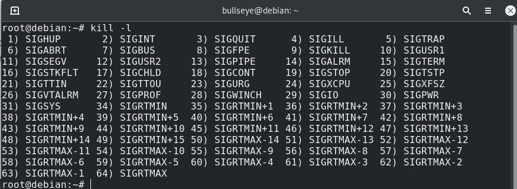
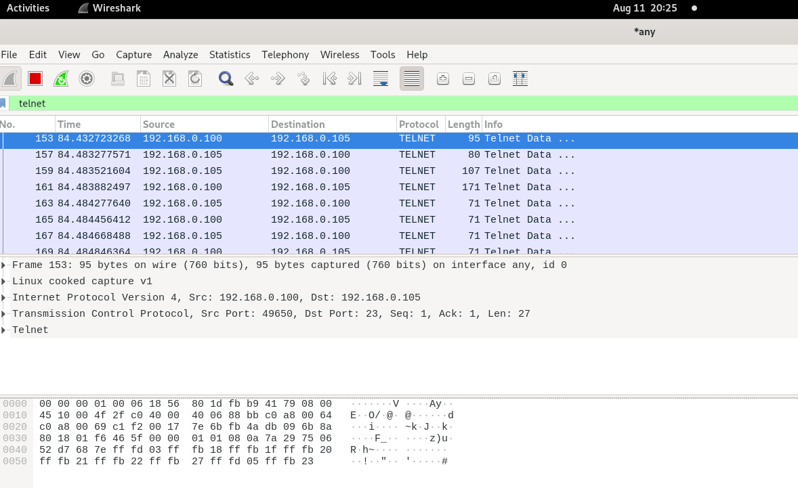

<h1>Task 5.3</h1>

<h2>Part 1</h2>

<h3>States of a process in Linux </h3>   

  

<h3> Examine the pstree command </h3>   

  


<h3> Proc file system  </h3>   

The **/proc/** directory — also called the **proc file system** — contains a hierarchy of special files which represent the current state of the kernel — allowing applications and users to peer into the kernel's view of the system.  

  

<h3>Print information about the processor</h3>   

   

<h3>Use the *ps* command</h3>

  

**ps** *command output explanation* 

-   **PID:** Process ID, shows the process identification number.
-   **TTY:** Identifies the terminal from which the process was executed.
-   **TIME:** Shows the processor’s time occupied by the program.
-   **CMD:** Shows the command used to launch the process.
-   **USER:** shows the effective user, whose permissions are used to run the process.
-  **%CPU:** Displays the calculation of time used by the process divided by the time the process is in execution.
- **%MEM:** This column shows the RSS (Resident set size) divided by the used memory. 
- **VSZ:** Shows the virtual memory used by the process.
- **RSS:** Resident set size. Shows the memory occupied by a process in the ram memory (not in swap).
- **START:** This column shows when the process started.
- **TIME:** CPU usage of process or thread, incremented each time the system clock ticks and the process or thread is found to be running
- **COMMAND:** This is the same as the previously explained CMD column.
- **STAT:** The column stats show code states for the process. 
- **UID:** Shows the ID of the user who executed the process.
- **PPID:** Shows the PID parent process.
- **PRI:** Shows the process priority (Kernel)
- **NI:** Shows the process priority (User space)
- **WCHAN:** Shows the name of the kernel function in which the processes sleep.


<h3>Kernel and User proccesses </h3>

 - **Kernel** proccesses - Always runs in user mode and uses user space only
 - **User** proccesses - Always runs in kernel mode and uses kernel space only

<h3>Print the list of processes to the terminal</h3>  

**ps aux**

  


<h3> Display only the processes of a specific user</h3>  

**ps -fU bullseye**  

  


<h3>Utilities can be used to analyze existing running tasks</h3>  

*We can use **top** o **htop** utilities:*  


*htop*

  


<h3>Explore **top** utility</h3>

  


-   **PID:** Shows task’s unique process id.
-   **PR:** Stands for priority of the task.
-   **SHR:** Represents the amount of shared memory used by a task.
-   **VIRT:** Total virtual memory used by the task.
-   **USER:** User name of owner of task.
-   **%CPU:** Represents the CPU usage.
-   **TIME+:** CPU Time, the same as ‘TIME’, but reflecting more granularity through hundredths of a second.
-   **SHR:** Represents the Shared Memory size (kb) used by a task.
-   **NI:** Represents a Nice Value of task. A Negative nice value implies higher priority, and positive Nice value means lower priority.
-   **%MEM:** Shows the Memory usage of task.


*Display the processes of the specific user using the **top** command*  

***top -u bullseye***

  

<h3>Examples of interactive commands in **top**</h3>

Highlight **Running Process** in top : Press ‘z‘

  

Shows **Absolute Path** of Processes:  Press ‘c‘

  


<h3>Sort the output of the processes window using various parameters</h3>


***Shift+P*** Sort by CPU usage (default)  

  

***Shift+M***  Sort by memory usage  

  

***Shift+ < or >*** Sort by any other parametr (TIME+)

   


<h3> Concept of priority, commands, used to set priority </h3>

- **Priority value**  The priority value is the process’s actual priority which is used by the Linux kernel to schedule a task. In Linux system priorities are 0 to 139 in which 0 to 99 for real-time and 100 to 139 for users.
- **Nice value**  Nice values are user-space values that we can use to control the priority of a process. The nice value range is -20 to +19 where -20 is highest, 0 default and +19 is lowest.

***Nice*** command will launch a process with an user defined scheduling priority. 
***Renice*** command will modify the scheduling priority of a running process.


<h3> Change the priority of a process using the **top** command </h3>

Press **r**, give PID value, give renice value:

   


<h3>  Examine the kill command </h3>

   

_Signals can be specified in three ways:_

-   By number (e.g. -5)
-   With SIG prefix (e.g. -SIGkill)
-   Without SIG prefix (e.g. -kill)  

*send SIGkill signal*

   


<h3> Explore commands jobs, fg, bg, nohup </h3>

-   **jobs** - Display a list of the jobs with their status
-   **fg** - Move a background job into the foreground
-   **bg** - Resume suspended jobs by running them as background jobs
-   **nohup** - Can protect a command from the _SIGHUP_ signal.
-   
   


<h2>Part 2</h2>  


<h3>Check the  OPENSSH commands in the MS Windows operating system</h3>

```
# Install the OpenSSH Client
Add-WindowsCapability -Online -Name OpenSSH.Client~~~~0.0.1.0
# Install the OpenSSH Server
Add-WindowsCapability -Online -Name OpenSSH.Server~~~~0.0.1.0
# Chech if installed
Get-WindowsCapability -Online | ? Name -like 'OpenSSH*'
```  
   

```
# Start the sshd service
Start-Service sshd

# OPTIONAL but recommended:
Set-Service -Name sshd -StartupType 'Automatic'

# Confirm the firewall rule is configured. It should be created automatically by setup.
Get-NetFirewallRule -Name *ssh*

# There should be a firewall rule named "OpenSSH-Server-In-TCP", which should be enabled
# If the firewall does not exist, create one
New-NetFirewallRule -Name sshd -DisplayName 'OpenSSH Server (sshd)' -Enabled True -Direction Inbound -Protocol TCP -Action Allow -LocalPort 22
```

   


```
# generate private and public keys
ssh-keygen -t RSA
```


    


```
# Start the service
Start-Service ssh-agent
# This should return a status of Running
Get-Service ssh-agent
# Now load your key files into ssh-agent
ssh-add ~\.ssh\id_rsa
```


  

```
# Use **scp** to copy the public key file generated previously on your client to the  authorized_keys file on your server
scp C:\Users\vladh\.ssh\id_rsa.pub bullseye@192.168.0.100:/.ssh/authorized_keys
# Connect to remote server
ssh bullseye@192.168.0.100
```

  


```
# Start & Stop ssh-server
net start sshd
net stop sshd
```


```
# Copy folder with images into remote server using scp
scp -r C:\img bullseye@192.168.0.100:Pictures/
```  

  


***Save passphrase (if exists) to a certain shell prompt using ssh-add***
```
ssh-add .ssh/fedora
```

  


***Allow new SSH port on SELinux***  


  


***Open SSH port on Firewalld***  


    


*result*  

  


<h3>SSH key types for encryption</h3>  


***SSH supports several public key algorithms for authentication keys. These include:***  

-   `rsa` - an old algorithm based on the difficulty of factoring large numbers. A key size of at least 2048 bits is recommended for RSA; 4096 bits is better. RSA is getting old and significant advances are being made in factoring. Choosing a different algorithm may be advisable. It is quite possible the RSA algorithm will become practically breakable in the foreseeable future. All SSH clients support this algorithm.
-   `dsa` - an old US government Digital Signature Algorithm. It is based on the difficulty of computing discrete logarithms. A key size of 1024 would normally be used with it. DSA in its original form is no longer recommended.
-   `ecdsa` - a new Digital Signature Algorithm standarized by the US government, using elliptic curves. This is probably a good algorithm for current applications. Only three key sizes are supported: 256, 384, and 521 (sic!) bits. We would recommend always using it with 521 bits, since the keys are still small and probably more secure than the smaller keys (even though they should be safe as well). Most SSH clients now support this algorithm.
-   `ed25519` - this is a new algorithm added in OpenSSH. Support for it in clients is not yet universal. Thus its use in general purpose applications may not yet be advisable.

***Create keys using ssh-keygen with different parametrs***

```
ssh-keygen -f<name> -t <type> -b <bits>
```

  

  

*Add key to remote server*  

  


<h3>Capture traffic with wireshark</h3>  

*configure wireshark*  

  

*SSH packages is encrypted*

  


*Telnet send data in plain text*  

  


*Telnet and SSH comparisone*


  