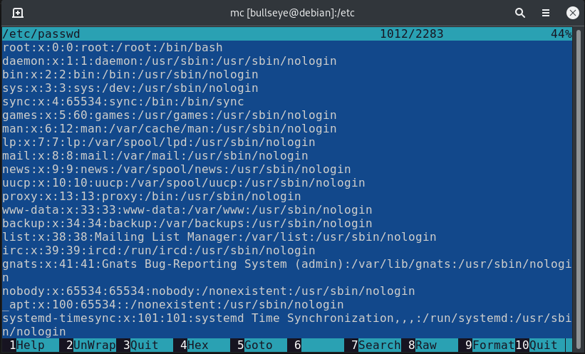
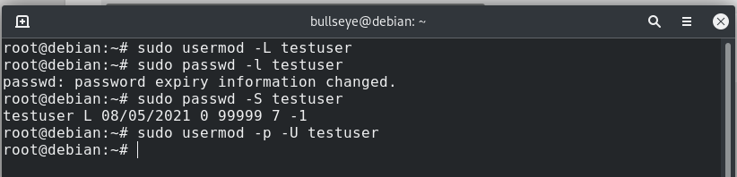

<h1>Task 5.2</h1>

<h3> Analyze the structure of the /etc/passwd and /etc/group file </h3>  

  

  

<h3> UID, range and how to define it </h3>  

**UID (user identifier)** is a number assigned by Linux to each user on the system. This number is used to identify the user to the system and to determine which system resources the user can access.

-   UID 0 (zero) is reserved for the root.
-   UIDs 1–99 are reserved for other predefined accounts.
-   UID 100–999 are reserved by system for administrative and system accounts/groups.
-   UID 1000–10000 are occupied by applications account.
-   UID 10000+ are used for user accounts.

  

  

<h3> GID </h3>  

 **GID(group identifier)** is a collection of users having similar permissions

Groups in Linux are defined by GIDs (group IDs).

-   GID 0 (zero) is reserved for the root group.
-   GID 1–99 are reserved for the system and application use.
-   GID 100+ allocated for the user’s group.  

    

  

<h3>Add user, set a password, delete user with home and mail directories</h3>  

    

<h3>Change the username</h3>  

  

<h3>Examine /etc/skel/ dir</h3>  

The **/etc/skel** directory contains files and directories that are automatically copied over to a new user’s home directory when such a user is created by the useradd command.  

  

<h3> Lock and Unlock user account </h3>  

    

<h3>Provide user with a password-free login</h3>  

  

<h3> Display the extended format of information about the directory </h3>  

  

  

<h3> What access rights exist and for whom  </h3>  

  

<h3>Change the owner of a file or directory and modify access to the file</h3>  

  

  

<h3>Using umask</h3>  

   

<h3>Sticky bits and mechanism of identifier substitution</h3>  

**Sticky bit** is a permission bit which is set on a file or folder, thereby permitting only the owner or root user of the file or folder to modify, rename or delete the concerned directory or file

  

  
<h3>Set the permissions on bash script </h3>

  