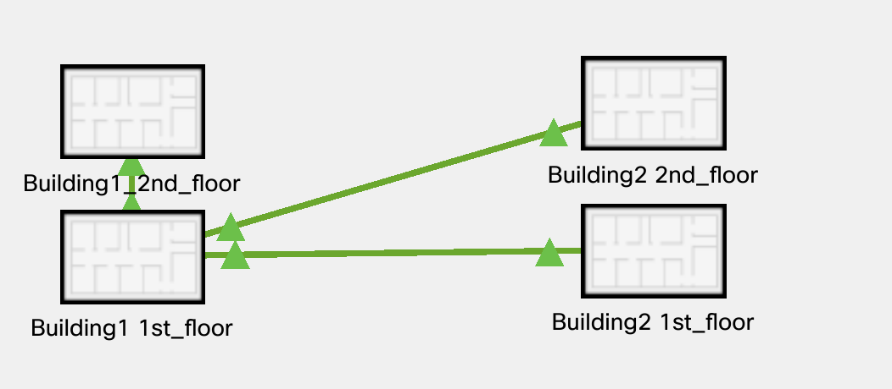
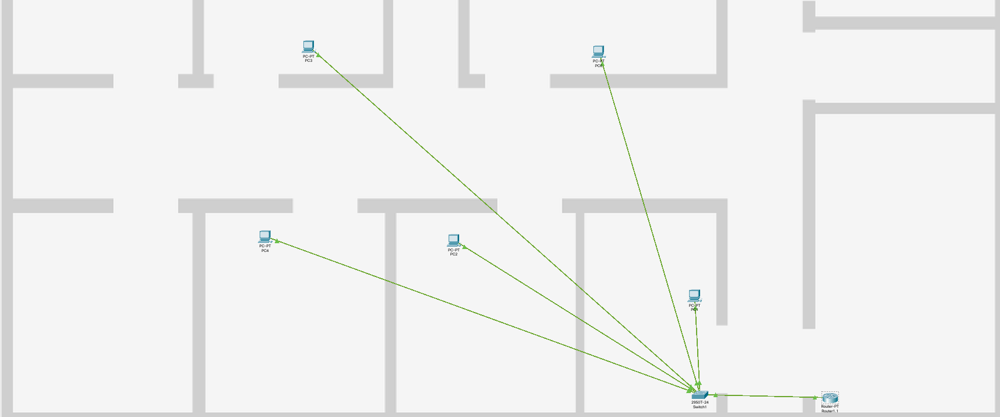
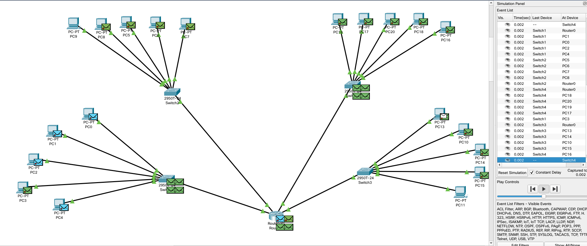
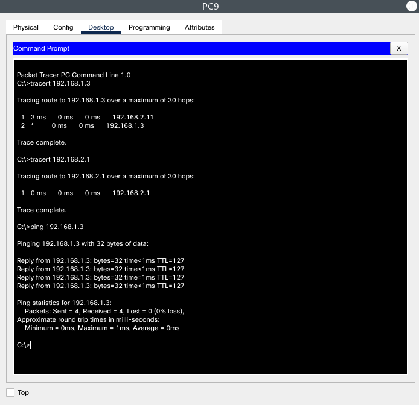
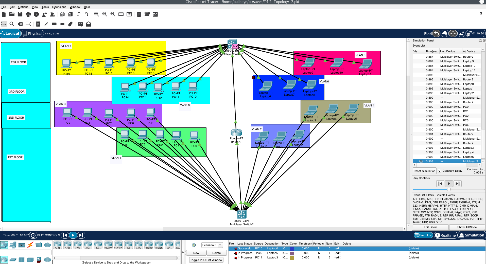
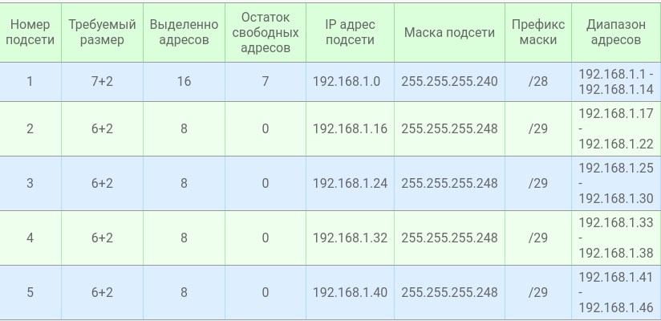
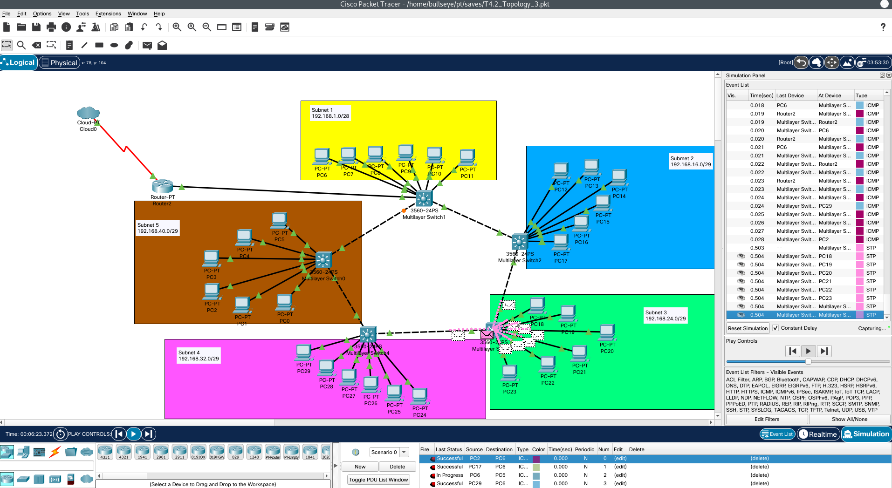

<h1>Task 4.2</h1>

<h3>1. Build the corporate network of the organization that contains
2 houses with 2 floors in each. Checking network availability.</h3>

***Physical mode*** 

 

  

***Сhecking if the network is working***  

  

  

<h3>2. Modeling a corporate network</h3>

***Network consists of 8 different VLANs  
Configure InterVLAN Routing and ISL/802.1Q Trunking  && Test the network***  

  

<h3>3. Modeling a LAN with 5 subnets </h3>  

***Configure and testing connections***  

  

  

