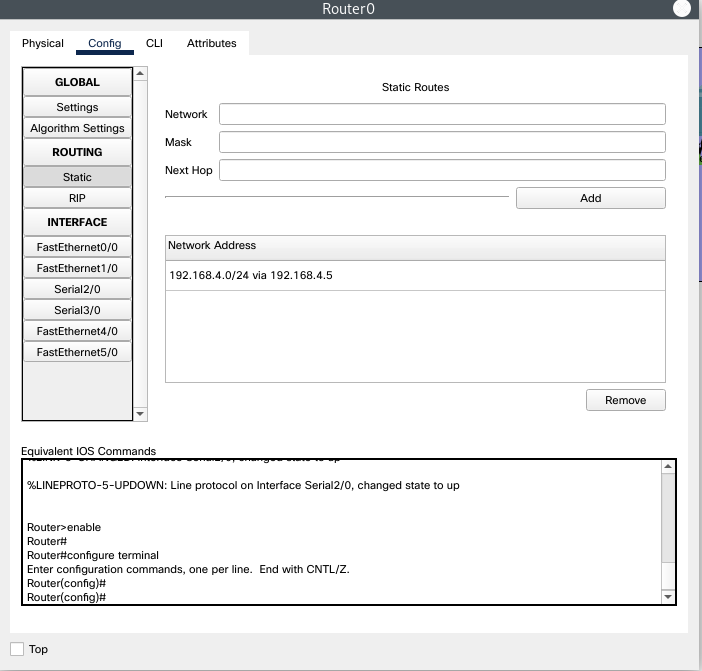
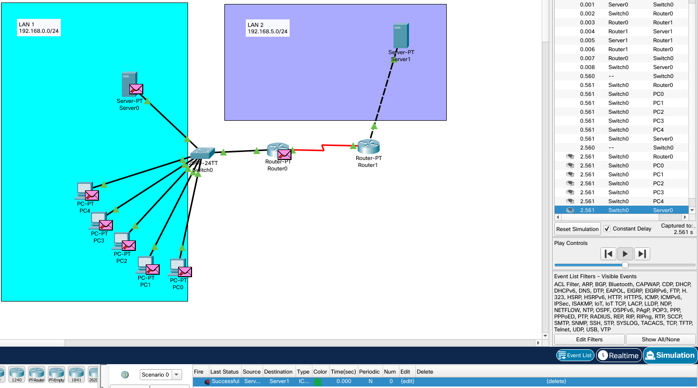
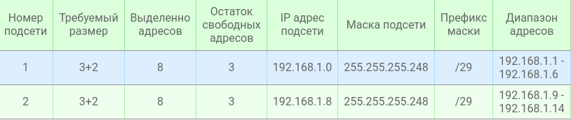
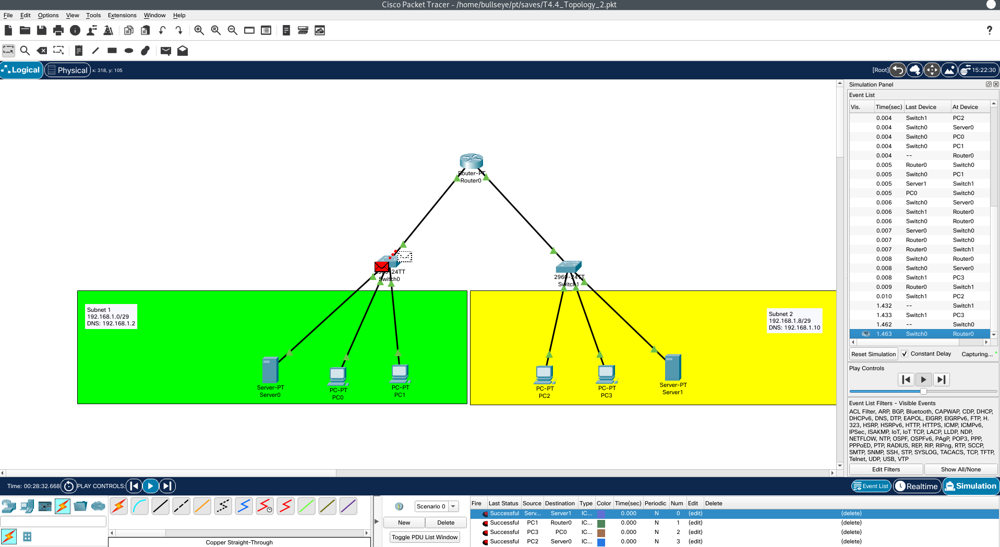
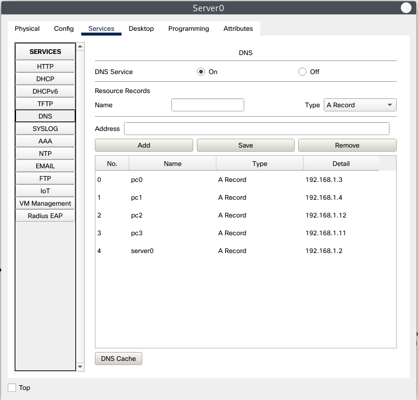
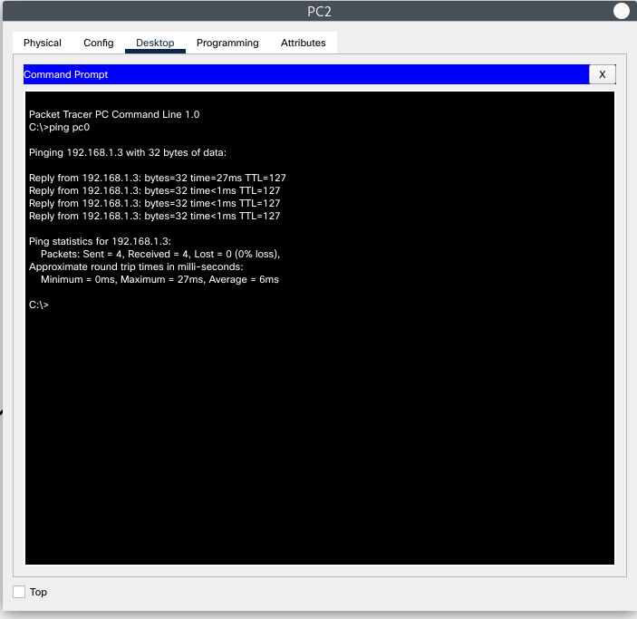

<h1>Task 4.4</h1>  

<h3>1. Configure routing between 2 LANs. </h3>  

*Configure static tables*

  

*Check connection between LAN 1 & LAN 2*

  

<h3>2. Modeling 2 subnets. Configure DNS records on servers. </h3>  

*Build topology:*

  

  

Configure & Chech DNS records:

  

  

