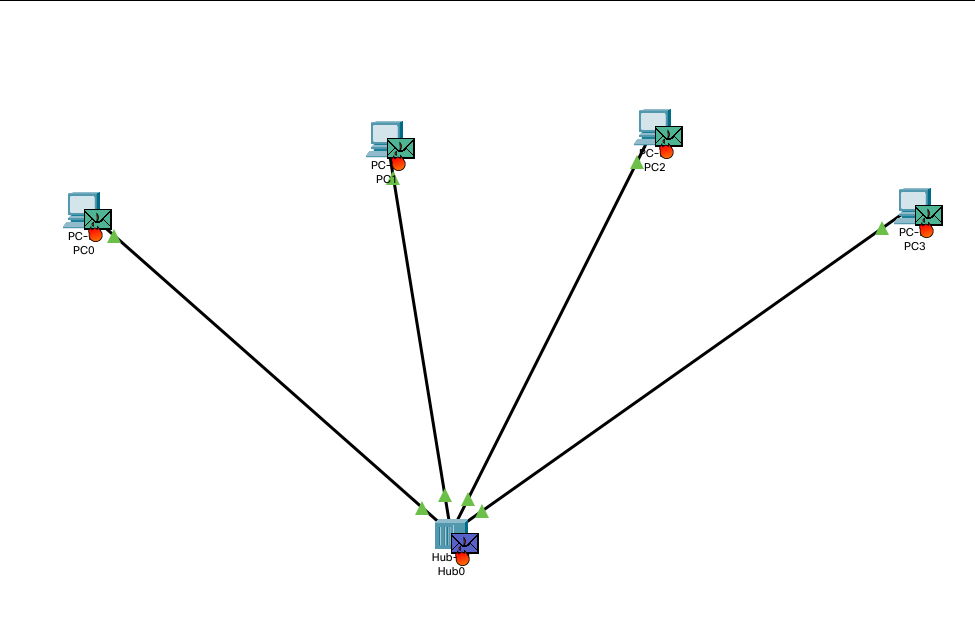
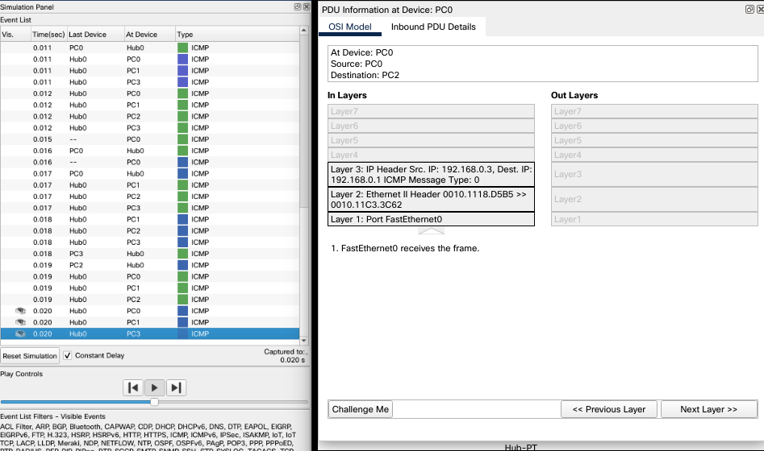
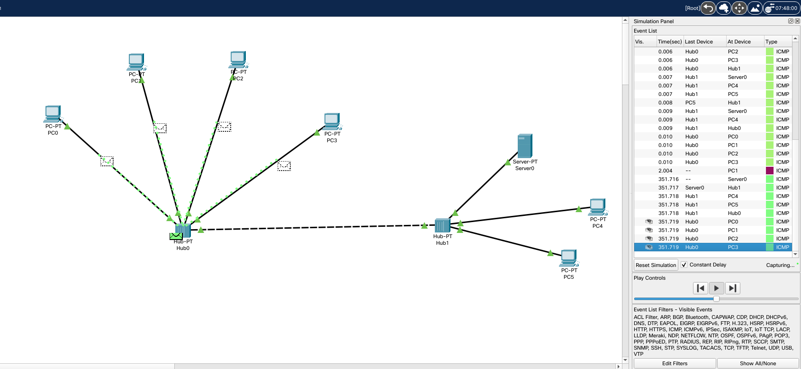
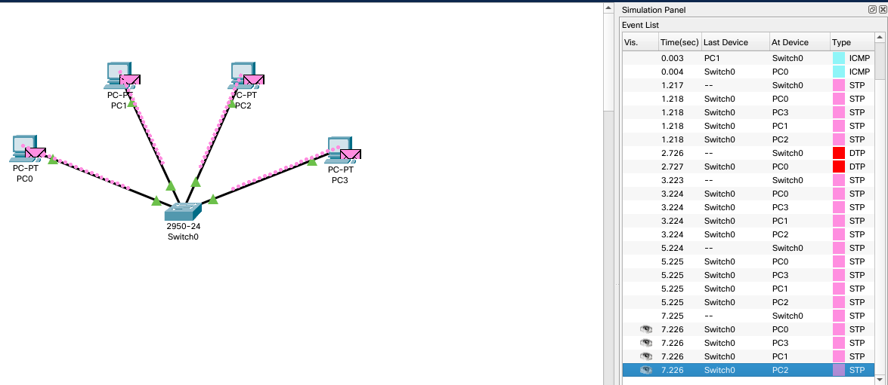
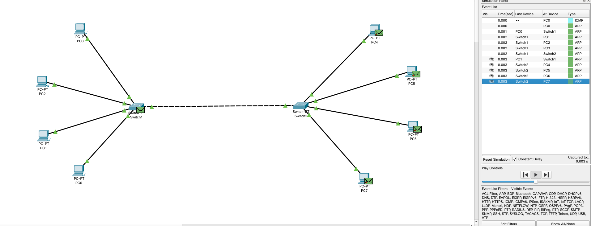
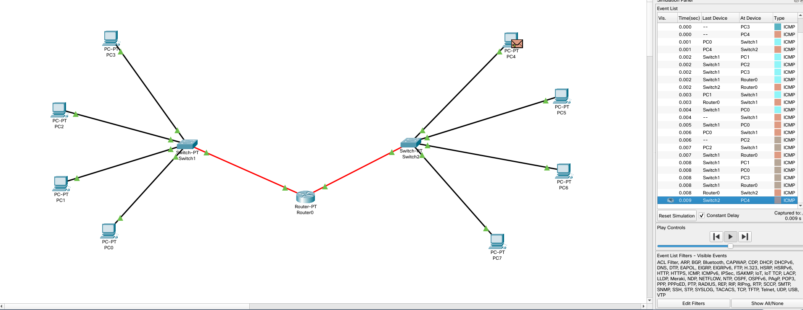
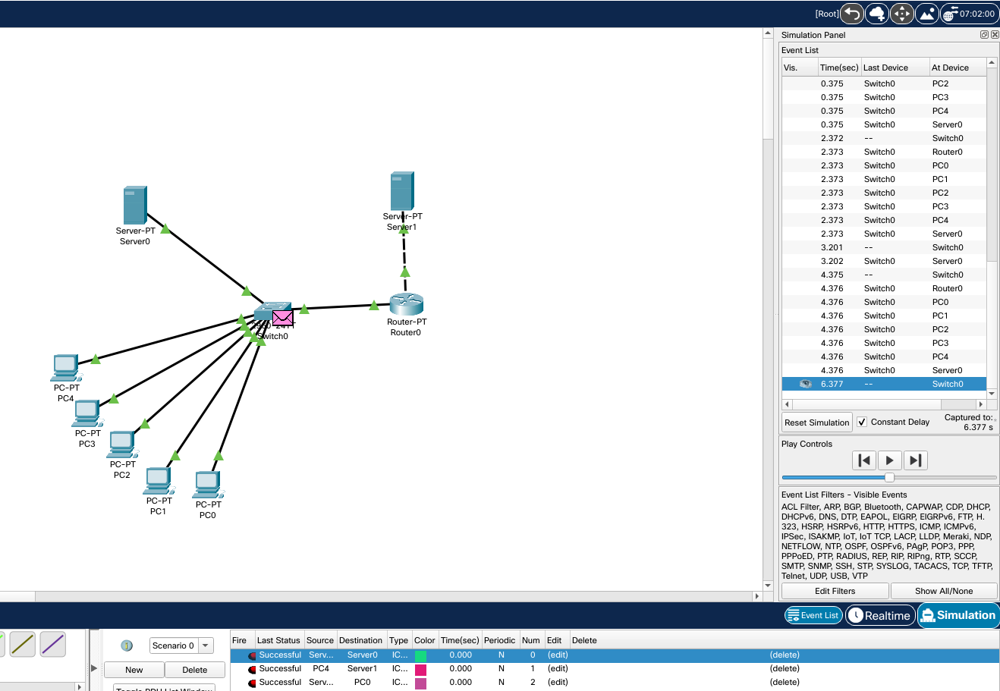

<h1>Task 4.1</h1>

1. <h2>Create the project (Topology 1). Check the performance of the network.</h2>  

 

  
 

2. <h2>Create the project (Topology 2). Check the performance of the network.</h2>

  

3. <h2>Create the project (Topology 3). Check the performance of the network.</h2>   

  

4. <h2>Expand the previous project according to Topology 4. Check the performance of the network </h2>  

  

5. <h2>Divide the existing network into two subnets according to Topology 5. Check the performance of the network, analyze the result</h2>  

  

<h2>Build and configure the LAN regarding topology 1</h2>  

  

