<h1>Task 8.1</h1>
<h3>Write script that solve quadratic equation like 𝑎𝑥2 + 𝑏𝑥 + 𝑐 = 0</h3>

<h4>Required functions:</h4>

main()

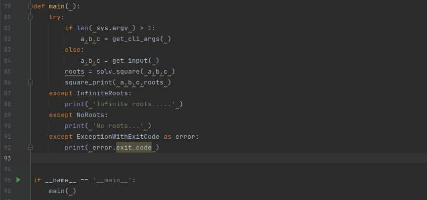   

validate_param()

 

discriminant(a, b, c)

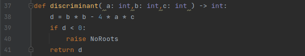 

roots(d, a, b, c)

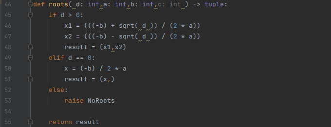 

solv_square(a, b, c) 

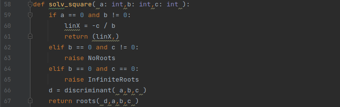 

square_print(a, b, c, roots)

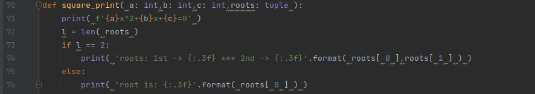 

<h4>Unit tests for functions </h4>

***discriminant()***

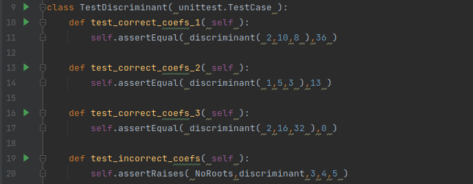 

***roots()*** 

 

***solv_square()***

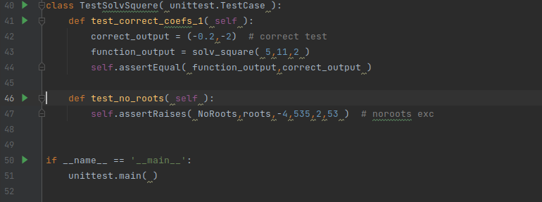 

**Run tests**

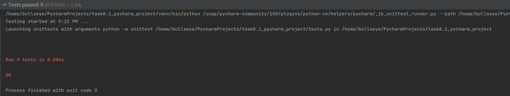 

<h4>Test script with different arguments</h4>

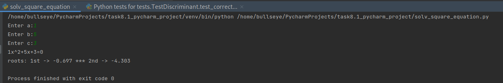 

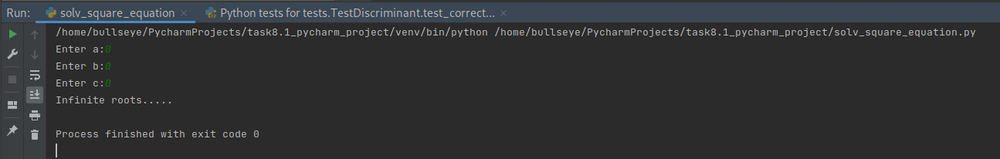 

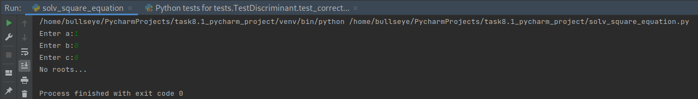 

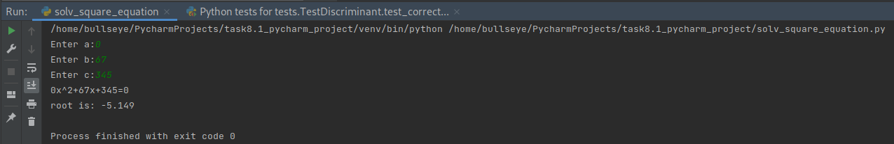 

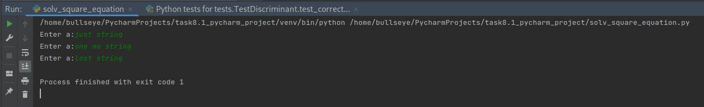 

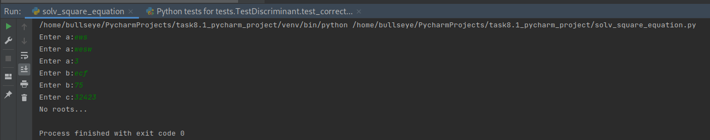 

**Send arguments with CLI**

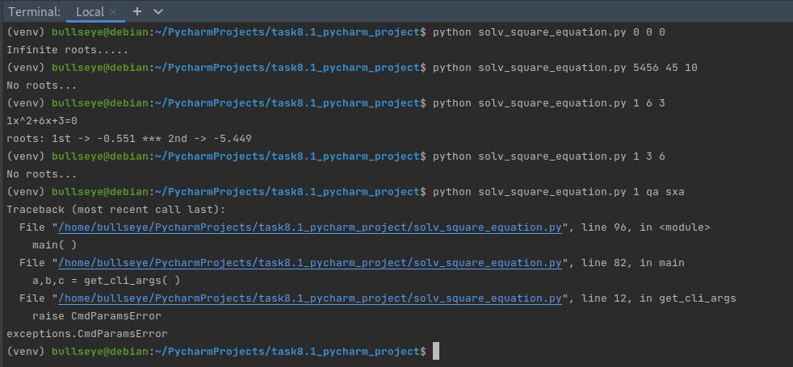 
