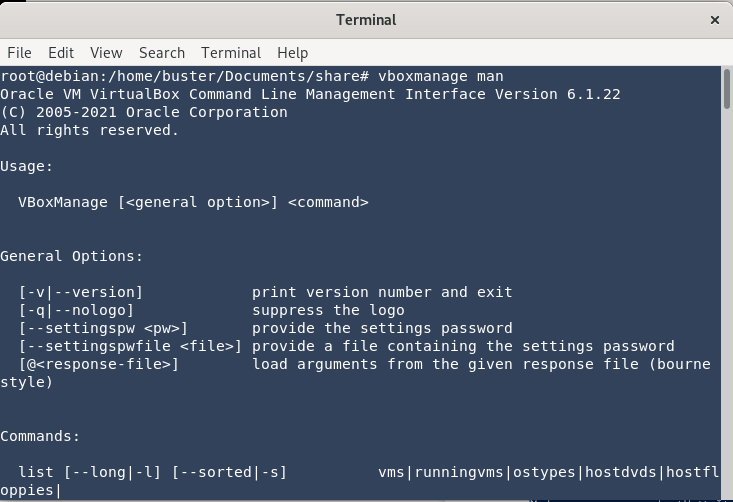
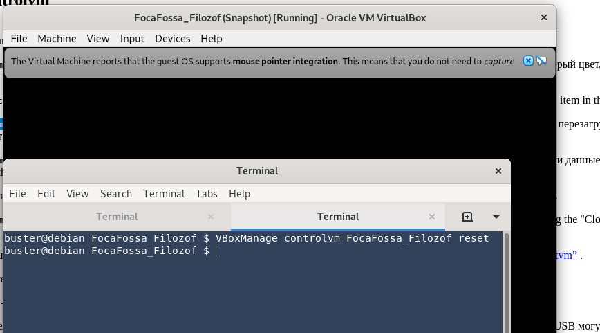

<h1>TASK 2.1</h1>

<h2>Part 1. Hypervisors</h2>  

 1. **What is the most popular hypervisors?**  
 
    *According to data for 2021, most popular Type 1 hypervisors is:*
    
   - VMware vSphere/EXSi
   - Hyper-V
   - Xen
   - RHEV

2. **Brief description of main differences between  popular hypervisors:**  

   *There are two main types of hypervisors: Type 1 & Type 2. The main differences between them can be seen in the table below.*  

| Criteria       | Type 1 Hypervisor                                     | Type 2 Hypervisor           |
|----------------|-------------------------------------------------------|-----------------------------|
| AKA            | Bare-metal or Native                                  | Hosted                      |
| Definition     |  Runs directly on the system with VMs running on them | Runs on the conventional OS |
| Virtualization | Hardware virtualization                               | OS virtualization           |
| Scalability    | Better scalability                                    | No so much                  |
| Speed          | Faster                                                | Slower                      |
| Performance    | Higher-performance                                    | Lower-performance           |
| Security       | More secure                                           | Less secure                 |

   *Also hypervisors are divided into*
- Type 3(Monolithic) 
 *Includes hardware device drivers*
- Type 4(Microkernel)
   *Drivers located inside Host OS*

<h2>Part 2. Work with VirtualBox </h2>  

 1. **First run** 
   
 - Download and install latest version of VirtualBox  
 
   
 
 - Download Ubuntu 21.04_amd64  
 
  
  
  - Create VM1 and install Ubuntu   
  
  

 - Configuration of VM1  

    
   2. **Clone VM1 , create VM2.**   
   
       
       

  3. **Create group "Test"**
  
      

 4. **Take a snapshots, create a tree of snapshots**  

    

5. **Export & Import VM**

  
   

6. **Configuration of VMs**

 

-  USB connection 

   download  and install Extension Package for VB   
    
     

    add USB device
 
     

  - Configure a shared folder  
       
     

- Check network connection   

|                  | VM to HOST  | HOST to VM  | VM1 to VM2  | Internet    |
|------------------|-------------|-------------|-------------|-------------|
| Bridged Adapter  | +           | +           | +           | +           |
| NAT              | +           | Unreachable | Unreachable | +           |
| Internal Network | Unreachable | Unreachable | +           | Unreachable |
|                  |             |             |             |             |

 

7. **Work with CLI through VBoxManage**  

- Check the man page VBoxManage  
  
   

- Execute basic commands  

   
   
   

<h2>Part 3. Work with Vagrant</h2>

1. **Download Vagrant**    

   

2. **Initialize the environment and SSH connection**   

    
  

3. **Record the date**  

  

4. **Stop & Delete VM**  

5. **Create a Vagrant Box**  

  
  

6. **Create a LAMP test environment**  

  
  

